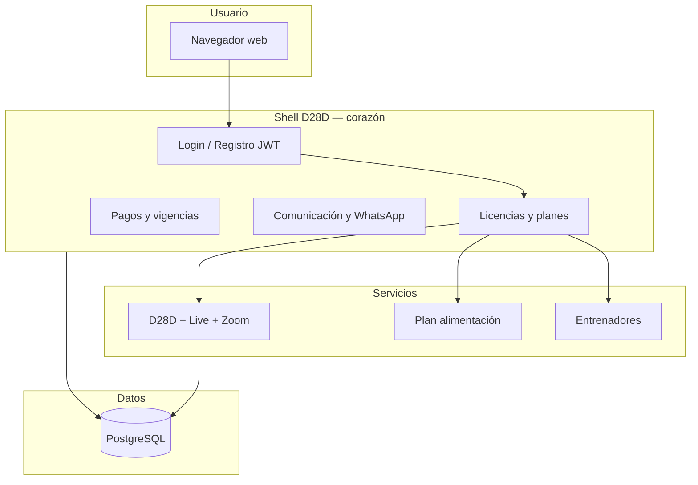

# Manual del ecosistema MVPFOOD / D28D

**Versión:** 4.0 — Mayo 2026  
**Audiencia:** operadores, administradores, coaches y usuarios finales que necesitan entender qué hace la plataforma, cómo fluye la información y dónde encontrar cada herramienta.

> **Manuales por módulo:** la documentación operativa detallada vive en **[docs/MANUALES/](./MANUALES/README.md)** — nueve guías independientes (plataforma, D28D, Food, Training, pagos, comunicación, configuraciones, usuario final y despliegue). Este documento es el **índice maestro** y la visión de conjunto.

---

## Índice de manuales modulares

| # | Manual | Cuándo leerlo |
|---|--------|---------------|
| 01 | [Plataforma y acceso](./MANUALES/01_PLATAFORMA_Y_ACCESO.md) | Login, registro, roles, maestros, SSO |
| 02 | [Módulo D28D](./MANUALES/02_MODULO_D28D.md) | Programas, ciclos, clases, Zoom, retos |
| 03 | [Plan de alimentación (Food)](./MANUALES/03_MODULO_FOOD.md) | Catálogo, recetas, registro diario |
| 04 | [Entrenadores (Training)](./MANUALES/04_MODULO_TRAINING.md) | Rutinas, galería, seguimiento |
| 05 | [Planes, pagos y vigencias](./MANUALES/05_PLANES_PAGOS_VIGENCIAS.md) | Oferta comercial, pareja, Wompi |
| 06 | [Comunicación y WhatsApp](./MANUALES/06_COMUNICACION_Y_WHATSAPP.md) | Plantillas, eventos, soporte |
| 07 | [Configuraciones y administración](./MANUALES/07_CONFIGURACIONES_ADMIN.md) | Apariencia, FAQ, auditoría |
| 08 | [Guía usuario final](./MANUALES/08_USUARIO_FINAL.md) | Inicio, Mi cuenta, progreso |
| 09 | [Despliegue y operación](./MANUALES/09_DESPLIEGUE_OPERACION.md) | Local, staging, E2E, backup |

---

## 1. Qué es este ecosistema

**MVPFOOD / D28D** es una plataforma modular para operar programas de bienestar, nutrición y entrenamiento bajo una sola cuenta. No es una app genérica: es el **sistema operativo** de un negocio fitness con:

- **Un solo registro y un solo login** para el usuario.
- **Varios servicios** que se activan según el plan o licencia contratada.
- **Marca blanca** opcional por gimnasio (logo, colores, mensaje, WhatsApp).
- **Multi-sede**: cada gimnasio ve solo sus usuarios y clases.

Piensa en la plataforma como un edificio con cuatro pisos independientes pero conectados:

| Piso | Nombre | Para qué sirve |
|------|--------|----------------|
| 1 | **D28D** | Programas (Vital, Pancitas, Virtual), ciclos de 28 días, clases en vivo con Zoom |
| 2 | **Plan de alimentación** | Calculadora nutricional, catálogo de alimentos, recetas, registro diario |
| 3 | **Entrenadores** | Rutinas, galería de ejercicios, seguimiento de atletas |
| 4 | **Clases en vivo** | Calendario, inscripción y asistencia (experiencia del usuario bajo D28D) |

El usuario final entra al **Inicio**, ve solo las tarjetas de los servicios que tiene activos y entra a cada uno con un clic.

---

## 2. Estructura técnica (cómo está construido)

```
MVPFOOD/
├── src/                          ← Interfaz web (React + Vite)
│   ├── components/               Pantallas: registro, dashboard, módulos
│   ├── components/dashboard/     Maestros, paneles D28D/Food/Training
│   ├── components/admin/         Comunicación, planes, auditoría
│   └── services/api.js           Conexión con el backend (JWT)
│
├── backend/                      ← Servidor API (Node + Express)
│   ├── server.js                 Arranque
│   ├── prisma/schema.prisma      Modelo de base de datos
│   └── src/
│       ├── controllers/          Lógica: auth, pagos, clases, food…
│       ├── routes/               URLs /api/*
│       ├── services/             Licencias, comunicación, pagos
│       └── models/               Acceso a datos (PostgreSQL)
│
├── modules/
│   ├── food_version_final/       Módulo Food embebido (NestJS + React)
│   └── training_version_final/   Módulo Training embebido
│
└── docs/                         Este manual
```

### Capas del sistema



**Shell D28D** = autenticación, planes comerciales, pagos, licencias, comunicación y marca.  
**Módulos embebidos** = Food y Training tienen su propia lógica interna pero entran con el mismo usuario (SSO).

---

## 3. Flujo del proceso (de punta a punta)

### 3.1 Registro de un usuario nuevo

```
Datos personales → Código de invitación (opcional) → Plan / módulos → Cuenta creada
```

| Paso | Qué ingresa el usuario | Qué sale del sistema |
|------|------------------------|----------------------|
| 1 | Nombre, email, contraseña, datos básicos | Validación de email único |
| 2 | Código invite (gym, coach o D28D) | `module_access`: qué servicios puede usar |
| 3 | Selección de plan (si aplica) | Cuenta con estado activo o pendiente de pago |
| 4 | Confirmación | HTTP 201, evento `user.registered` en auditoría |

**Plan pareja:** el titular compra un plan `is_couple`; recibe un código `PAREJA-…`. El segundo usuario se registra y usa **Redimir código pareja** → comparte la misma vigencia sin pagar de nuevo.

### 3.2 Login y dashboard

1. Email + contraseña → **token JWT** (válido ~7 días).
2. Pantalla **Inicio** con tarjetas: D28D, Food, Training, Live (solo las licenciadas).
3. **Mi cuenta**: plan activo, vencimiento, botón **Contactar soporte** (WhatsApp).

### 3.3 Compra de licencia / pago

```
Usuario elige plan → Método de pago → Estado pendiente o activo → Admin confirma → Licencia vigente
```

| Método | Qué pasa |
|--------|----------|
| **Pago en sede** | Cuenta queda `pendiente_sede`; admin recibe notificación |
| **Wompi online** | Abre checkout; queda `pendiente_pago_online` hasta confirmación |
| **Transferencia / activo directo** | Cuenta activa de inmediato (según configuración) |

El **Super Admin** o admin de pagos entra a **Vigencias**, confirma o rechaza → se actualiza `fecha_vencimiento`, licencias del módulo y notificación al usuario. Eventos: `payment.approved` / `payment.rejected`.

### 3.4 Operación D28D (clases en vivo)

```
Admin programa clase → Usuario se inscribe → Entra por Zoom → Asistencia registrada
```

Si cambia el **horario** de una clase ya publicada → evento `d28d.class.time_changed` (auditoría).

### 3.5 Soporte WhatsApp

1. Cada plan puede tener número, nombre y mensaje de soporte.
2. Por defecto: **+57 319 263 5819** → `https://wa.me/573192635819`
3. Mensaje dinámico según programa (Vital, Food, Entrenadores…).
4. Al pulsar **Contactar soporte** → evento `support.whatsapp.click` en auditoría.

---

## 4. Maestros del sistema (panel de administración)

Acceso: menú **Maestros** (solo roles con permiso, principalmente **super_admin**).

| Maestro | Contenido | Quién lo usa |
|---------|-----------|--------------|
| **D28D** | Programas, ciclos, clases, galería, gimnasios, Zoom por programa | Super admin, Admin D28D |
| **Plan de alimentación** | Catálogo, recetas, planes nutricionales, seguimiento | Admin food, coaches |
| **Entrenadores** | Coaches, rutinas, galería, atletas | Admin training, entrenadores |
| **Planes y licencias** | Precios, módulos incluidos, invites por programa, plan pareja | Super admin |
| **Configuraciones** | Comunicación, pagos, apariencia, auditoría, vigencias | Super admin |

### Configuraciones (detalle)

| Sección | Función |
|---------|---------|
| **Comunicación** | Plantillas de mensajes, log de eventos, WhatsApp por plan, auditoría de emails/clics |
| **Enlaces de pago** | URLs Wompi y métodos por módulo (food, training, d28d) |
| **Apariencia** | Textos, imágenes y branding del frontend |
| **Auditoría** | Acciones del sistema (login, cambios admin) |
| **Vigencias** | Confirmar pagos, extender licencias, ver vencimientos |

---

## 5. Roles y quién ve qué

| Rol | Descripción | Acceso típico |
|-----|-------------|---------------|
| **super_admin** | Control total de la plataforma | Todo: maestros, pagos, comunicación, auditoría |
| **admin_d28d** | Operación programas y clases | D28D, gimnasios, live |
| **admin_food_plan** | Operación nutrición | Food, catálogo, recetas |
| **admin_training** | Operación entrenadores | Training, rutinas, coaches |
| **admin_gimnasio / admin_marca** | Dueño de sede marca blanca | Su gym: usuarios, clases, vigencias |
| **entrenador / nutricionista** | Coach operativo | Sus atletas, rutinas o food |
| **usuario_final** | Cliente | Solo servicios de su plan |

**Regla multi-sede:** un admin de gimnasio **nunca** ve datos de otra sede. El `gym_id` viaja en el token de sesión.

---

## 6. Qué información entra y qué sale (por área)

### D28D / Clases en vivo

| Entra | Sale |
|-------|------|
| Programa, ciclo, título de clase, horario, link Zoom | Calendario de clases, inscripciones |
| Datos del coach anfitrión | Notificación al host, asistencia al entrar |
| Cambio de horario | Evento `d28d.class.time_changed` |

### Plan de alimentación

| Entra | Sale |
|-------|------|
| Alimentos del catálogo (admin) | Lista searchable para el usuario |
| Registro diario (comidas, porciones) | KPIs: calorías, macros, adherencia |
| Recetas | Plan semanal, equivalentes |
| Peso, objetivo (calculadora) | TMB/TDEE recomendado |
| Chat nutricional (opcional IA) | Respuesta asistida |

### Entrenadores

| Entra | Sale |
|-------|------|
| Rutinas (días, ejercicios, series) | Plan asignado al atleta |
| Videos de galería | Rutina con enlaces YouTube |
| Log de sesión completada | Progreso y adherencia |
| Sustitución de ejercicio | Rutina ajustada sin romper el plan |

### Pagos y licencias

| Entra | Sale |
|-------|------|
| Plan elegido, método de pago | Cuenta con estado y vencimiento |
| Confirmación admin | Licencia activa + notificación |
| Extensión manual | Nueva `fecha_vencimiento` |

### Comunicación

| Entra | Sale |
|-------|------|
| Plantilla (evento, canal, texto) | Mensaje preparado para el evento |
| Clic en soporte WhatsApp | Log con usuario, plan, fecha |
| Eventos del sistema (registro, pago, clase) | Registro en `communication_event_logs` |

---

## 7. Reportes y seguimiento

| Reporte / vista | Dónde | Qué muestra |
|-----------------|-------|-------------|
| **Seguimiento food** | Panel Food → Seguimiento | Adherencia nutricional del usuario |
| **Progreso training** | Panel Training | Sesiones completadas, rutinas |
| **Asistencia live** | Clases en vivo | Quién entró a Zoom y cuándo |
| **Vigencias** | Configuraciones → Vigencias | Cuentas por vencer, pendientes de pago |
| **Auditoría sistema** | Configuraciones → Auditoría | Logins, cambios admin |
| **Centro comunicación** | Configuraciones → Comunicación → Auditoría | Emails, notificaciones, clics WhatsApp, errores |
| **Coach D28D tracking** | Panel D28D | Seguimiento de participantes por programa |

No hay un módulo de “Business Intelligence” separado: los reportes viven dentro de cada servicio y en las pantallas de auditoría/vigencias.

---

## 8. Programas D28D

| Programa | Público | Contenido típico |
|----------|---------|------------------|
| **Vital D28D** | Bienestar integral | Ciclos 28 días, clases en vivo |
| **Pancitas Fit** | Embarazo | Rutinas adaptadas, clases especializadas |
| **Virtual D28D** | Transformación clásica | Programa flagship online |

Cada programa tiene **ciclos** (bloques de 28 días), **clases programadas** y **Zoom** configurado a nivel de programa.

---

## 9. Pagos y vigencias (resumen operativo)

- **Panel Vigencias:** ver pendientes, confirmar pago, rechazar, extender días.
- **Licencias:** tabla `module_licenses` con `valid_until` sincronizada al confirmar.
- **Notificaciones internas:** el usuario ve avisos de pago pendiente o confirmado en su cuenta.
- **Food embebido** mantiene su propia suscripción interna; el shell unifica D28D y Training.

---

## 10. Centro de comunicación y WhatsApp

Ubicación: **Maestros → Configuraciones → Comunicación**

| Pestaña | Para qué |
|---------|----------|
| **Plantillas** | Crear/editar mensajes por evento (registro, pago, clase…) |
| **Eventos** | Listado filtrable: fecha, evento, canal, usuario, módulo |
| **WhatsApp** | Número, mensaje y estado por plan; botón probar enlace |
| **Auditoría** | Historial completo de comunicaciones y errores |

**Eventos automáticos registrados:**

- `user.registered`
- `payment.approved` / `payment.rejected`
- `d28d.class.scheduled` / `d28d.class.time_changed`
- `support.whatsapp.click`

Número global por defecto: **573192635819** (Colombia).

---

## 11. Arranque local (desarrollo)

```bash
docker compose up -d postgres
cp backend/.env.example backend/.env
cp .env.example .env
npm install && cd backend && npm install && cd ..
cd backend && npx prisma migrate deploy && npx prisma generate
npm run dev:all
```

| Servicio | URL |
|----------|-----|
| Frontend | http://localhost:5175 |
| Backend API | http://localhost:3002/api |
| Health | http://localhost:3002/api/health |
| PostgreSQL | localhost:5434 |

### Credenciales de prueba

Contraseña común: **`Demo!2026`**

| Email | Rol |
|-------|-----|
| `admin@foodplan.local` | super_admin |
| `admin.d28d@foodplan.local` | admin_d28d |
| `admin.food@foodplan.local` | admin_food_plan |
| `admin.entrenador@foodplan.local` | admin_training |
| `usuario.demo@foodplan.local` | usuario_final |

Rescate de contraseñas tras reset de BD: `npm run seed:dev`

---

## 12. Despliegue a producción

1. PostgreSQL gestionado + `DATABASE_URL` segura.
2. `USE_RELATIONAL_STORAGE=true`
3. `JWT_SECRET` ≥ 32 caracteres (nunca en git).
4. `npx prisma migrate deploy` + `npx prisma generate`
5. Build frontend: `npm run build`
6. Backend con CORS apuntando al dominio real.
7. Variable opcional: `SUPPORT_WHATSAPP_DEFAULT=573192635819`
8. Validar: `npm run test:comm` contra la URL de staging.

### Backup PostgreSQL

```bash
./scripts/backup_postgres.sh
# Salida: backups/pg/mvpfood_YYYYMMDD_HHMMSS.dump
```

Restore: ver script y `pg_restore` en la documentación del repositorio (`scripts/backup_postgres.sh`).

---

## 13. Pruebas automatizadas

| Comando | Qué valida |
|---------|------------|
| `npm run test:comm` | Comunicación, WhatsApp, registro (21 checks) |
| `npm run test:commercial` | Planes, pareja, registro comercial (20 checks) |
| `npm run test:ux` | Retos, FAQ, asistente, progreso (26 checks) |
| `npm run test:phases` | Fases 1–6 por script bash |
| `npm run test:e2e` | Smoke integral (14 checks) |

**Total local validado:** 81/81. Checklist staging: [STAGING_READINESS.md](./STAGING_READINESS.md). Detalle operativo: [Manual 09](./MANUALES/09_DESPLIEGUE_OPERACION.md).

---

## 14. Estado actual del ecosistema (Mayo 2026)

| Área | Estado |
|------|--------|
| Registro (D28D, Food, Training, Pareja) | OK |
| Licencias y planes comerciales | OK |
| Pagos y vigencias | OK |
| D28D + clases + cambio horario | OK |
| Food (shell + módulo embebido) | OK en piloto |
| Training | OK |
| WhatsApp + wa.me | OK |
| Centro de comunicación | OK |
| Auditoría | OK |
| Frontend maestros y configuraciones | OK |
| Base de datos PostgreSQL + Prisma | OK |

**Principio de evolución:** mejorar sin reescribir. Las capacidades operativas existentes se preservan; los cambios son incrementales.

---

## 15. Glosario rápido

| Término | Significado |
|---------|-------------|
| **Shell** | Plataforma central D28D (auth, planes, pagos) |
| **module_access** | Objeto JSON que define qué módulos tiene un usuario |
| **Invite code** | Código que asigna gym, coach o preset D28D al registrarse |
| **White-label** | Marca personalizada por gimnasio |
| **Vigencia** | Fecha hasta la cual la licencia está activa |
| **SSO** | Entrada al módulo Food/Training con el mismo login del shell |

---

*Índice maestro del ecosistema. Manuales por módulo: [docs/MANUALES/](./MANUALES/README.md). Instalación del código: [README del repositorio](../README.md).*
