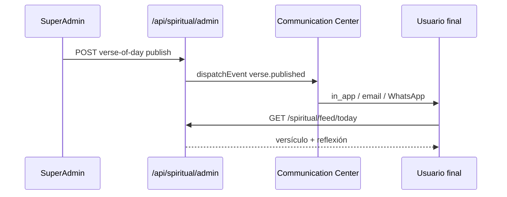
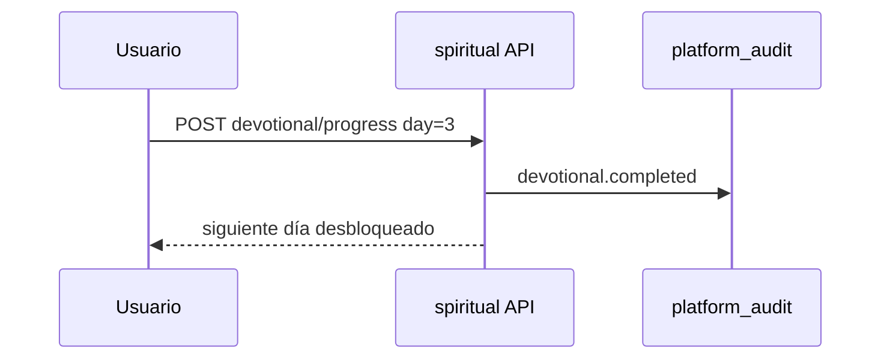

# VIENTO RECIO — Flujos de usuario

**Versión:** 0.1 (diseño)  
**Regla UX:** El nombre «VIENTO RECIO» **no aparece** en flujos de usuario final, coach ni gym.

---

## 1. Matriz de visibilidad

| Rol | ¿Ve «Centro de Formación»? | ¿Ve módulo/servicio VIENTO RECIO? | ¿Consume contenido? |
|-----|----------------------------|-----------------------------------|-------------------|
| Super Admin | ✅ Admin completo | ✅ (solo admin) | ✅ |
| Admin D28D | ❌ | ❌ | ❌ (salvo decisión futura — hoy solo SuperAdmin) |
| Coach | ❌ | ❌ | ✅ Asignado a su comunidad |
| Gym admin | ❌ | ❌ | ✅ Asignado a su sede |
| Usuario final | ❌ | ❌ | ✅ Widgets integrados |

---

## 2. Super Admin — Centro de Formación Espiritual

### Acceso

```
Login → Maestros → Configuraciones → Centro de Formación Espiritual
```

Alternativa: item en `MastersHub` visible **solo** `super_admin`.

### Flujo: publicar versículo del día

```
1. SuperAdmin abre «Versículo del día»
2. Selecciona fecha + versículo (búsqueda biblia) o texto libre
3. Escribe reflexión
4. Asigna alcance: Global | Gym X | Trainer Y
5. [Programar] o [Publicar ahora]
6. Sistema:
   - Guarda spiritual_verse_of_day
   - dispatchEvent('verse.published') → Communication Center
   - platformAudit.log('verse.published')
7. Usuarios con alcance ven widget actualizado al entrar a Progreso/Inicio
```

### Flujo: crear devocional 21 días

```
1. Crear plan → 21 días
2. Por cada día: versículo + reflexión + oración + desafío
3. Asignar a comunidad
4. Usuario inicia plan → devotional.started
5. Cada día completado → progreso + devotional.completed (día)
6. Plan completo → devotional.completed (plan) + opcional reto espiritual vinculado
```

### Flujo: asignar estudio PDF a un gym

```
1. Subir estudio (PDF) + categoría + autor
2. Asignación → scope_type=gym, scope_gym_id=5
3. Usuarios con gym_id=5 ven estudio en «Estudios recomendados»
4. Usuarios otros gyms: no ven
```

### Flujo: moderar testimonio

```
1. Usuario envía testimonio (pending)
2. SuperAdmin cola moderación → approve/reject
3. Si approved + asignado → visible en feed comunidad asignada
4. audit: testimony.approved
```

### Flujo: evento virtual con Zoom

```
1. Crear evento virtual + enlace Zoom (manual o integración futura S2S)
2. Usuarios inscriben → registration
3. Job event.reminder 24h y 1h antes
4. Click unirse → attendance + audit
```

### Flujo: reto espiritual (oración 7 días)

```
1. SuperAdmin → Retos espirituales → Crear
2. Backend: d28d_challenges con reglas.kind=spiritual, spiritual_type=prayer
3. Asignación comunidad
4. Usuario ve en widget «Retos activos» (sin label D28D fitness)
5. Inscripción/evidencia: mismo API retos existente
6. Comunicación: challenge.started / challenge.completed
```

---

## 3. Usuario final — experiencia integrada

### Punto de entrada principal

**Vista Progreso** (`Dashboard` → Progreso) — sección superior **«Hoy»** (sin marca VIENTO RECIO):

```
┌─────────────────────────────────────────┐
│ Hoy                                     │
│ ─ Versículo del día                     │
│ ─ Devocional (día 3 de 21) [Continuar]  │
│ ─ Próximo evento: Jueves 19:00          │
│ ─ Reto activo: 7 días de gratitud       │
└─────────────────────────────────────────┘
… (debajo: Food charts / D28D / Training sin cambiar orden existente)
```

### Flujo: leer biblia

```
Progreso → [Explorar Biblia] o link en versículo del día
→ Selector libro/capítulo
→ Lectura versículos
→ [Favorito] [Nota privada] [Marcador]
→ audit: bible.read (opcional agregado)
```

### Flujo: petición de oración

```
Widget → [Oración] → Formulario título + texto
→ Visibilidad: privada | comunidad | solo líderes
→ Crear → prayer.request.created (notifica líderes según plantilla)
→ Usuario puede marcar «Respondida» + nota
→ SuperAdmin/coach asignado puede comentar seguimiento
```

### Flujo: usuario Food-only con contenido espiritual asignado

```
1. Login shell (misma contraseña Food)
2. Inicio: tarjeta FOOD_PLAN (sin cambios)
3. Progreso: aparece sección «Hoy» espiritual SI hay asignación global/gym/trainer
4. NO aparece servicio nuevo en Inicio
5. NO aparece en Mis Servicios
6. Asistente Food: intacto (A3 piloto — sin duplicar)
```

### Flujo: usuario D28D + Food + Training

```
Progreso muestra:
  - Sección espiritual «Hoy» (arriba)
  - Charts Food (si legacy embebido)
  - D28D progreso + retos fitness (separados de retos espirituales)
  - Training semáforo
```

---

## 4. Coach — consumo sin módulo

### Lo que ve

- En **Seguimiento**: pestaña opcional «Comunidad espiritual» (V1.1) con peticiones `leaders_only` de sus clientes
- Notificación in-app si plantilla configurada
- **No** ve menú «Viento Recio»
- **No** crea devocionales globales

### Flujo: acompañar petición

```
1. Coach abre Seguimiento → cliente X → Peticiones (si visibilidad permite)
2. Comentario de seguimiento (spiritual_prayer_comments)
3. Cliente recibe notificación in-app
```

---

## 5. Gym — consumo sin módulo

### Lo que ve

- Contenido asignado a `gym_id` en widgets de usuarios de su sede
- Reportes agregados en admin gym (V2): asistencia eventos espirituales sede
- **No** administra biblia ni devocionales globales

---

## 6. Diagramas de secuencia (resumen)

### Publicación versículo → usuario



### Devocional día completado



---

## 7. Estados y transiciones

### Testimonio

`pending` → `approved` | `rejected`

### Petición oración

`open` → `answered` → `closed`

### Evento

`draft` → `published` → `completed` | `cancelled`

### Devocional usuario

`not_started` → `in_progress` → `completed`

---

## 8. Copy UX (sin marca producto)

| Evitar | Usar |
|--------|------|
| VIENTO RECIO | — (no mostrar) |
| Módulo espiritual | «Hoy», «Formación», «Devocional» |
| Servicio Viento Recio | «Versículo del día», «Estudio bíblico» |
| Activar licencia Viento | (no existe) |

---

## 9. Integración con flujos existentes (sin alterar)

| Flujo existente | Impacto |
|-----------------|---------|
| Registro comercial | Ninguno |
| Mis Servicios | Ninguno |
| FOOD SSO | Ninguno |
| Retos D28D fitness | Lista separada por `reglas.kind` |
| Communication Center admin | Nueva sección filtros modulo=spiritual |
| FAQ / HelpAssistant | Independiente |

---

## 10. Criterios de aceptación UX

- [ ] Usuario final descubre versículo del día en ≤ 2 clics desde login
- [ ] Coach no ve ítem de navegación «Viento Recio»
- [ ] SuperAdmin accede al centro en ≤ 3 clics desde Inicio
- [ ] Usuario Food-only no ve cambios en tarjeta FOOD_PLAN
- [ ] Petición de oración creable en ≤ 3 campos

---

*Flujos de usuario — diseño VIENTO RECIO.*
