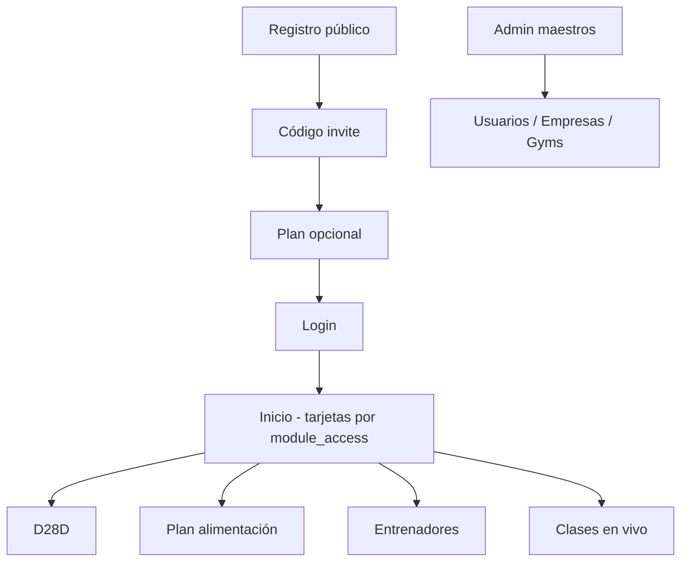

# Guía de revisión del proyecto — MVPFOOD / D28D Gimnasio Virtual

**Versión:** 1.0 — Mayo 2026  
**Ubicación:** `docs/manuales/` (toda la documentación de revisión vive aquí)

Este documento es el **punto de entrada único** para revisar modelo de negocio, idea, funcionalidades, estructura, herramientas, riesgos y oportunidades. Los detalles están en los archivos enlazados de esta misma carpeta.

---

## 1. Qué es el producto (resumen ejecutivo)

**Sistema operativo modular** para coaches, gimnasios marca blanca y programas formativos (D28D), no una “super app” genérica.

Tres servicios sobre un solo login:

| Servicio | Valor para el cliente |
|----------|------------------------|
| **D28D** | Programas (Vital, Pancitas, Virtual), gimnasios marca blanca, plantillas de clases |
| **Plan de alimentación** | Calculadora, catálogo, recetas, registro diario |
| **Entrenadores** | Rutinas, galería, usuarios asignados |
| **Clases en vivo** | Agenda, Zoom, asistencia (vive bajo D28D en la experiencia) |

**Registro público:** datos → **código de invitación** (D28D / gym / coach) → plan opcional → dashboard según `module_access`.

Documentos clave: [VISION_Y_POSICIONAMIENTO_ECOSISTEMA.md](./VISION_Y_POSICIONAMIENTO_ECOSISTEMA.md), [ECOSISTEMA_MODULAR_MARCA_BLANCA.md](./ECOSISTEMA_MODULAR_MARCA_BLANCA.md)

---

## 2. Modelo de negocio e idea funcional

| Pregunta | Dónde leer |
|----------|------------|
| ¿Para quién es? (ICP) | [VISION](./VISION_Y_POSICIONAMIENTO_ECOSISTEMA.md), [GTM](./GTM_LATAM_COACHES_Y_GYMS.md) |
| ¿Qué prometemos y qué NO? | [VISION](./VISION_Y_POSICIONAMIENTO_ECOSISTEMA.md), [ROADMAP](./ROADMAP_REALISTA_ECOSISTEMA.md) |
| ¿Cómo se vende en LATAM? | [GTM](./GTM_LATAM_COACHES_Y_GYMS.md) |
| ¿Cómo validamos antes de escalar? | [PILOTO](./PILOTO_ECOSISTEMA_FITNESS.md) |
| Mapa estratégico consolidado | [CONSOLIDACION](./CONSOLIDACION_ESTRATEGICA_ENTREGABLE.md) |

---

## 3. Funcionalidades

| Alcance | Documento |
|---------|-----------|
| **Lo que existe hoy (Core)** | [ROADMAP](./ROADMAP_REALISTA_ECOSISTEMA.md) § Core, [MANUAL](./MANUAL_PLATAFORMA_D28D.md) |
| **Lo que NO está (futuro)** | [ROADMAP](./ROADMAP_REALISTA_ECOSISTEMA.md) § Futuro |
| Experiencia por rol (pantallas) | [ARQUITECTURA_VISIBLE](./ARQUITECTURA_VISIBLE_EXPERIENCIA.md) |
| Entrenamiento (detalle) | [RESUMEN_MODULOS_ENTRENAMIENTO](./RESUMEN_MODULOS_ENTRENAMIENTO.md), [TRAINING_MODULE](./TRAINING_MODULE.md) |
| Registro + códigos invite | [VERIFICACION_PRODUCCION](./VERIFICACION_PRODUCCION.md) |

---

## 4. Estructura del software

```
Frontend (React + Vite)  →  API Express  →  PostgreSQL + Prisma
     src/                      backend/         Docker local :5434
```

| Capa | Carpeta | Documento |
|------|---------|-----------|
| UI | `src/` | [MANUAL](./MANUAL_PLATAFORMA_D28D.md), [ARQUITECTURA_VISIBLE](./ARQUITECTURA_VISIBLE_EXPERIENCIA.md) |
| API | `backend/` | [DOCUMENTO_TECNICO](./DOCUMENTO_TECNICO_FOOD_PLAN.md) |
| Datos | `backend/prisma/` | [INFRAESTRUCTURA_RELACIONAL](./INFRAESTRUCTURA_RELACIONAL.md) |
| Instalación repo | raíz | `../../README.md` |

**Multi-tenant:** `gym_id`, `trainer_id`, `module_access` en usuario/JWT.  
**Roles admin:** `super_admin`, `admin_d28d`, `admin_food`, `admin_entrenador`, etc.

---

## 5. Herramientas utilizadas

| Área | Herramientas |
|------|----------------|
| Frontend | React 19, Vite 7, Tailwind 4, Axios, React Router |
| Backend | Node 20, Express 5, JWT, bcrypt, rate limit |
| Base de datos | PostgreSQL 16, Prisma ORM |
| Dev local | Docker Compose, Adminer (opcional) |
| IA (opcional) | Ollama local + fallback determinístico |
| Calidad | ESLint, Vitest (mínimo), scripts smoke en `scripts/` |

Detalle: [DOCUMENTO_TECNICO](./DOCUMENTO_TECNICO_FOOD_PLAN.md) § Herramientas (validar fechas con [INFRAESTRUCTURA_RELACIONAL](./INFRAESTRUCTURA_RELACIONAL.md)).

---

## 6. Riesgos

| Tipo | Documento |
|------|-----------|
| Riesgos estratégicos / narrativa | [CONSOLIDACION](./CONSOLIDACION_ESTRATEGICA_ENTREGABLE.md) §5 |
| Riesgos técnicos y deuda | [AUDITORIA_PROFESIONALIZACION](./AUDITORIA_PROFESIONALIZACION_ECOSISTEMA.md) |
| Bloqueantes pre-piloto | [AUDITORIA_PRE_PILOTO](./AUDITORIA_PRE_PILOTO.md) |
| Despliegue / Prisma | [PRODUCCION_HOY](./PRODUCCION_HOY.md), [PRISMA_PRODUCCION](./PRISMA_PRODUCCION.md) |

**Riesgos frecuentes en operación:**

- Prometer features del roadmap como si ya existieran.
- Desplegar solo frontend sin backend + Postgres.
- Documentación desactualizada (JSON vs Prisma) — cruzar siempre con código y `INFRAESTRUCTURA_RELACIONAL`.

---

## 7. Oportunidades

| Oportunidad | Documento |
|-------------|-----------|
| LATAM coaches / gyms boutique | [GTM](./GTM_LATAM_COACHES_Y_GYMS.md) |
| Marca blanca + modularidad progresiva | [ECOSISTEMA_MODULAR](./ECOSISTEMA_MODULAR_MARCA_BLANCA.md) |
| Piloto medible antes de escalar | [PILOTO](./PILOTO_ECOSISTEMA_FITNESS.md) |
| Separación Core vs futuro (ventas honestas) | [ROADMAP](./ROADMAP_REALISTA_ECOSISTEMA.md) |

---

## 8. Flujo de usuario (referencia rápida)



---

## 9. Credenciales y prueba local

Ver [VERIFICACION_PRODUCCION](./VERIFICACION_PRODUCCION.md) y [MANUAL](./MANUAL_PLATAFORMA_D28D.md) § Credenciales.

| Rol | Email | Contraseña semilla |
|-----|--------|-------------------|
| Super admin | `admin@d28d.local` | `Demo!2026` |

---

## 10. Índice completo de archivos en esta carpeta

Ver [README.md](./README.md) de `docs/manuales/`.

---

*Al revisar, si un manual contradice el código, prima el código y actualiza el manual en esta carpeta.*
