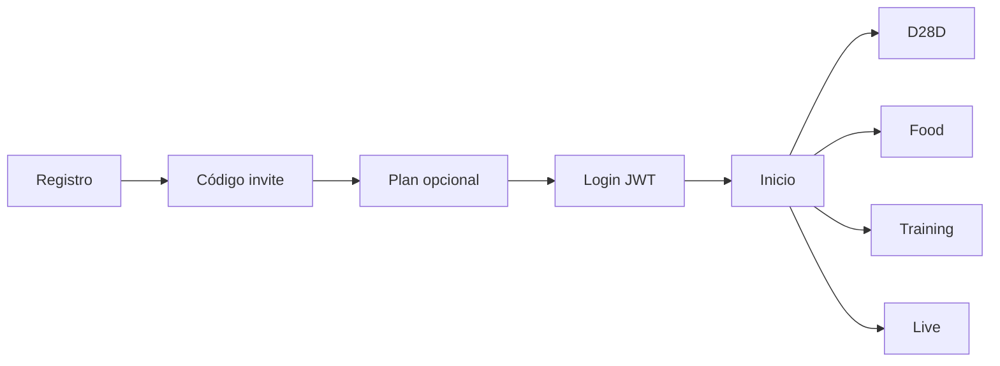

# Índice maestro — MVPFOOD / D28D Gimnasio Virtual

**Versión:** 2.1 — Mayo 2026  
**Carpeta:** `docs/manuales/` — solo **5 documentos**. El resto fue unificado aquí.

---

## Principio rector: Evolución sin destrucción

**Regla crítica de arquitectura** — aplica a todo cambio de código, documentación y roadmap.

### Prioridad del proyecto (NO es rehacer la plataforma)

- Profesionalizar, ordenar, modularizar, estabilizar, escalar, asegurar  
- Mejorar UX y mantenibilidad  
- **Preservar todas las capacidades funcionales ya operativas**

### Prohibido proponer sin justificación técnica explícita

- Reescrituras completas  
- Cambios innecesarios de stack  
- Reemplazo total de frontend o backend  
- Eliminar módulos o funcionalidades activas  
- Rediseños que obliguen a reconstruir el sistema  

### Antes de cualquier cambio, identificar

| Pregunta | Acción |
|----------|--------|
| ¿Qué existe? | Inventario en [03](./03_PRODUCTO_Y_OPERACION.md) (Core actual) |
| ¿Qué funciona? | Validar con smoke / piloto |
| ¿Qué está incompleto? | Roadmap futuro, no sustituir Core |
| ¿Qué puede mejorarse? | Evolución incremental sobre lo existente |

### Si hace falta refactorizar

1. Justificación técnica  
2. Impacto, riesgo y beneficio  
3. **Migración progresiva** (compatibilidad y continuidad operativa primero)

### Orden de prioridad

1. Compatibilidad  
2. Continuidad operativa  
3. Estabilidad  
4. Reutilización  
5. Deuda técnica controlada  

El valor ya desarrollado (D28D, food, training, live, roles, invites, white-label, Prisma/JSON dual) **se evoluciona, no se tira**.

Detalle de riesgos de violar este principio: [05](./05_RIESGOS_Y_AUDITORIA.md) §0.

---

## Los 5 documentos (lee en este orden)

| # | Archivo | Contenido |
|---|---------|-----------|
| 1 | **Este archivo** | Mapa, flujo, credenciales, arranque rápido |
| 2 | [02_NEGOCIO_Y_MERCADO.md](./02_NEGOCIO_Y_MERCADO.md) | Modelo de negocio, ICP, GTM LATAM, módulos, piloto |
| 3 | [03_PRODUCTO_Y_OPERACION.md](./03_PRODUCTO_Y_OPERACION.md) | Qué existe hoy, roles, pantallas, pruebas, códigos invite |
| 4 | [04_TECNICO_Y_DESPLIEGUE.md](./04_TECNICO_Y_DESPLIEGUE.md) | Stack, estructura código, Postgres/Prisma, despliegue |
| 5 | [05_RIESGOS_Y_AUDITORIA.md](./05_RIESGOS_Y_AUDITORIA.md) | Riesgos, oportunidades, hallazgos P0/P1, roadmap futuro |
| 6 | [06_FASE2_ANALISIS_BRECHAS.md](./06_FASE2_ANALISIS_BRECHAS.md) | **Fase 2:** brechas, arquitectura objetivo, roadmap, producción |

---

## Qué es el producto (30 segundos)

**Sistema operativo modular** para coaches, gimnasios y programas D28D — no una super app.

Un registro → código de invitación → dashboard con tarjetas según módulos activos:

- **D28D** (programas, gimnasios marca blanca, clases en vivo)
- **Plan de alimentación**
- **Entrenadores**
- **Clases en vivo** (experiencia bajo D28D)

---

## Flujo principal



---

## Arranque local (resumen)

```bash
docker compose up -d postgres
cp backend/.env.docker.example backend/.env   # JWT_SECRET + DATABASE_URL :5434
cp .env.example .env                          # VITE_API_BASE_URL=http://localhost:3002/api
npm install && cd backend && npm install
cd backend && npx prisma migrate deploy
cd backend && PORT=3002 npm run dev    # terminal 1
npm run dev                             # terminal 2 → http://localhost:5175
```

Semilla de prueba: `node scripts/seed_production_verify.cjs 'Demo!2026'`

---

## Credenciales de prueba

Contraseña común: **`Demo!2026`**

| Rol | Email |
|-----|--------|
| Super admin | `admin@d28d.local` |
| Admin D28D | `d28d.admin@d28d.local` |
| Admin food | `food.admin@d28d.local` |
| Admin entrenadores | `coach.admin@d28d.local` |
| Usuario D28D completo | `final.d28d@d28d.local` |
| Usuario gym | `final.gym@d28d.local` |
| Usuario coach | `final.coach@d28d.local` |

Códigos registro: `D28D-PILOTO`, `GYM-D28D-004`, `COACH-CARLOS-001`

Detalle en [03_PRODUCTO_Y_OPERACION.md](./03_PRODUCTO_Y_OPERACION.md).

---

## Regla de oro al revisar

1. **Ventas y demos** → solo lo marcado como *Core actual* en doc 03.  
2. **Código vs documentación** → si hay conflicto, prima el código y actualiza el manual.  
3. **Producción** → Postgres relacional + Prisma (doc 04), no solo archivos JSON.

---

## Código del repositorio

Instalación completa: [README del proyecto](../../README.md)
