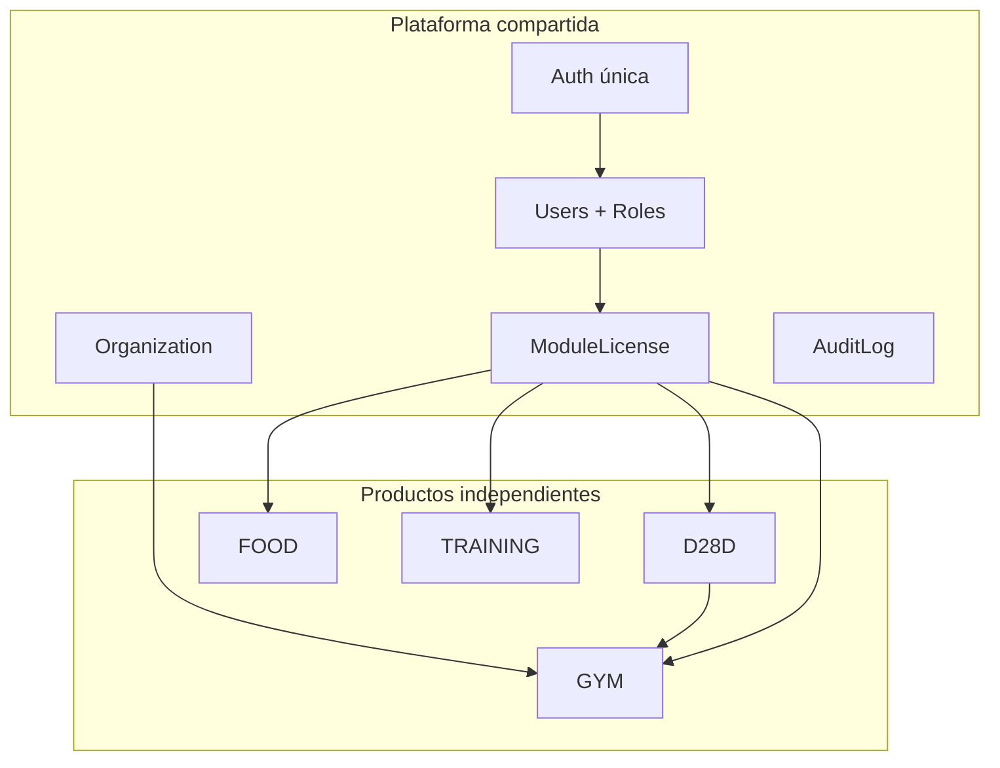

# FASE 2 — Análisis de brechas y arquitectura objetivo

**MVPFOOD / D28D Gimnasio Virtual**  
**Versión:** 1.0 — Mayo 2026  
**Base:** código en `backend/`, `src/`, `prisma/schema.prisma`, manuales `01`–`05`  
**Principio:** [Evolución sin destrucción](./01_INDICE_MAESTRO.md) — ninguna funcionalidad operativa se elimina; se evoluciona.

---

## 1. Resumen ejecutivo

### ¿Puede la plataforma evolucionar sin perder lo existente?

**Sí.** El repositorio ya implementa ~70–75% de la visión objetivo a nivel de capacidades:

- Autenticación única (JWT), registro con código obligatorio, roles jerárquicos, `module_access`, multi-tenant por `gym_id`, white-label en `Gym`, contenido D28D bloqueado (`locked`, `source_module`), programas/ciclos/clases/Zoom, food, training, auditoría (`AuditLog` + Winston), Postgres+Prisma para núcleo relacional.

### Brechas principales (no bloquean piloto; sí bloquean modelo comercial “4 productos + licencias”)

| Brecha | Impacto |
|--------|---------|
| **GYM** no es módulo/licencia de primer nivel (vive bajo tarjeta D28D) | Visión 4 productos independientes |
| **Licencias** no existen como entidad; hay `module_access` + `SubscriptionPlan`/`UserAccount` | Regla “sin planes/paquetes” vs modelo actual |
| **Organization** / multiempresa formal ausente | `admin_marca` sin tabla org |
| Rol **Entrenador D28D** no diferenciado de `entrenador` coach | Permisos demasiado amplios en `accessControl.js` |
| Dominios training/food parcialmente en `DomainDocument` JSON | Escalabilidad y reporting |
| **PaymentLink** inexistente | Fase pagos |

### Conclusión estratégica

La evolución es **incremental**: formalizar licencias encima de `module_access`, extraer producto GYM sin quitar pantallas actuales, estrechar rol D28D trainer, y migrar documentos de dominio a tablas sin apagar rutas actuales.

**No se recomienda** reescritura de stack (React/Express se mantienen).

---

## 2. Arquitectura actual (as-is)

```mermaid
flowchart TB
  subgraph client [Frontend React/Vite]
    Reg[Register 3 pasos]
    Dash[ServicesHero + module_access]
    D28D[D28DAdminView]
    Food[FoodPlan]
    Train[Training]
    Live[LiveClasses]
  end

  subgraph api [Express API]
    Auth[/api/auth + resolve-invite]
    Admin[/api/admin/*]
    Mod[/api/foods training live-classes programs cycles gyms trainers accounts]
  end

  subgraph data [Persistencia]
    PG[(PostgreSQL Prisma)]
    JSON[JsonStore + DomainDocument]
  end

  Reg --> Auth
  Dash --> Mod
  Mod --> PG
  Mod --> JSON
  Auth --> PG
```

### Capas reales

| Capa | Implementación |
|------|----------------|
| Auth | JWT, `authMiddleware`, registro/login en `serverApp.js` o `authRoutes` |
| Permisos | `accessControl.js` → `roles[]` + `permissions[]` |
| Módulos UI | `userServices.js` → 4 IDs: `d28d`, `food-plan`, `training`, `live-classes` |
| Tenant | `gym_id`, `trainer_id` en User; filtros en admin |
| Invites | `inviteResolver.js` → gym / trainer / D28D presets |
| D28D | `ProgramSetting`, `Cycle`, `LiveClass` (locked) |
| Food | `FoodItem`, `Recipe`, `UserPlan`, food-log controllers |
| Training | `DomainDocument` collections + `adminTrainingController` |
| Cuentas | `SubscriptionPlan`, `UserAccount` (vigencias/sesiones) |
| Audit | `AuditLog` + `logger.js` SqlTransport |

### Módulos visibles hoy (dashboard)

Orden fijo en `userServices.js`: **D28D → Food → Training → Live**.  
**Gimnasio/marca blanca** = dentro de D28D (`D28DAdminView`), no tarjeta `gym`.

---

## 3. Arquitectura objetivo (to-be)



### Reglas de negocio objetivo (validación)

| Regla | Estado código |
|-------|----------------|
| Sin planes comerciales “premium” | **Parcial** — existe `SubscriptionPlan` + UI `AdminPlans` (evolucionar a licencias, no borrar rutas) |
| Sin paquetes | **Parcial** — invites presets combinan módulos (OK como onboarding; renombrar concepto) |
| 4 productos = 4 licencias | **Brecha** — `module_access` booleano, no tabla `License` |
| Cada módulo solo o combinado | **Cumple** vía `module_access` + roles |
| Entrenador D28D restringido | **Brecha** — rol `entrenador` genérico con `training.manage_own` |
| Coach/Gym WL sin editar D28D | **Cumple** — `canEditClass` + `programController` solo `admin_d28d` |

---

## 4. Validaciones obligatorias (13 ítems)

| # | Requisito | Estado | Evidencia |
|---|-----------|--------|-----------|
| 1 | Registro único | **Cumple** | `Register.jsx`, `POST /api/auth/register` |
| 2 | Código acceso obligatorio | **Cumple** | `resolve-invite`, registro exige código |
| 3 | Multiempresa | **Parcial** | `admin_marca` sin `Organization`; scope por `gym_id` |
| 4 | Multiorganización | **Parcial** | Múltiples gyms/trainers; sin jerarquía org→gyms |
| 5 | Licencias por módulo | **Parcial** | `User.moduleAccess` JSON; sin entidad License |
| 6 | WL coaches | **Cumple** | Trainer + invites; branding en gym para usuarios gym |
| 7 | WL gimnasios | **Cumple** | `Gym.whiteLabelEnabled`, colores, logo, slug |
| 8 | Roles jerárquicos | **Cumple** | 10+ roles en `accessControl.js`, `roles.js` |
| 9 | Multi-tenant seguro | **Cumple con riesgo** | Filtros admin por gym; requiere tests en cada ruta nueva |
| 10 | Dashboard modular | **Cumple** | `getEnabledServiceIds` |
| 11 | Zoom | **Cumple** | `ProgramSetting.zoomEmail`, links en `LiveClass` |
| 12 | Auditoría | **Parcial** | Tabla + UI `AuditDashboard`; depende de DB configurada |
| 13 | Escalabilidad | **Parcial** | Core en PG; training/food logs en JSON `DomainDocument` |

---

## 5. Matriz de brechas

| Área | Estado actual | Estado objetivo | Brecha | Prioridad | Esfuerzo | Riesgo |
|------|---------------|-----------------|--------|-----------|----------|--------|
| Producto GYM independiente | Gym bajo D28D UI | Tarjeta + licencia `gym` | Falta módulo UI/licencia explícito | P1 | M | Bajo si se añade sin quitar D28D |
| Licencias formales | `module_access` + invites | Tabla `ModuleLicense` por org/user | Sin vigencia centralizada por producto | P1 | M | Medio — migración dual-write |
| Sin “planes” comerciales | `SubscriptionPlan`, `AdminPlans` | Solo licencias + vigencias | Terminología y modelo legacy | P1 | S–M | Bajo si se alias, no se borra API |
| Organization | Solo Gym/Trainer | `Organization` → N gyms | No hay entidad | P2 | M | Medio |
| Entrenador D28D | `entrenador` amplio | Rol `entrenador_d28d` acotado | Puede administrar training/nutrition hoy | P0 | S | Alto si no se corrige antes piloto D28D |
| D28D corporativo | `admin_d28d`, programs | Mismo + biblioteca centralizada | Mayormente OK | P3 | S | Bajo |
| Coach marca blanca | `entrenador`, training routes | Igual + bloqueo D28D edit | OK en live/programs | P3 | S | Bajo |
| Gym marca blanca | `admin_gimnasio`, WL fields | Ver clases D28D, vigencias | Vigencias vía `UserAccount` no licencia | P2 | M | Bajo |
| Auth única | JWT | Igual | — | — | — | — |
| Pagos | `metodoPago` en account | `PaymentLink` | No existe | P2 | L | Medio |
| Datos relacionales | Prisma core + DomainDocument | Tablas normalizadas training/food | JSON híbrido | P1 | L | Medio — migración por colección |
| Audit completo | Logs admin + SQL transport | 100% acciones críticas | Cobertura incompleta | P2 | M | Bajo |
| Infra escala | Monolito Express | Cache, colas, réplicas | Estándar monolito | P3 | L | Bajo corto plazo |

---

## 6. Modelo de datos objetivo

| Entidad | Existe | Ajuste | Creación | Notas código |
|---------|--------|--------|----------|--------------|
| **User** | Sí (`users`) | — | — | `roles`, `permissions`, `moduleAccess` |
| **Role** | Implícito | Formalizar enum/ tabla opcional | Opcional | Hoy string en `rol` + JSON `roles` |
| **Organization** | No | — | **Sí** | `admin_marca` sin ancla |
| **CoachBrand** | Parcial | — | Evolucionar | `Trainer` + invites; sin tabla brand coach |
| **GymBrand** | Sí | — | — | `Gym` + white-label columns |
| **Module** | Parcial | — | Formalizar | `ecosystem_modules.json` / presets invite |
| **License** | No | — | **Sí** | Reemplazar semántica de `SubscriptionPlan` progresivamente |
| **PaymentLink** | No | — | **Sí** | Fase 4 |
| **Program** | Sí | — | — | `ProgramSetting` |
| **Cycle** | Sí | — | — | `Cycle` |
| **Class** | Sí | — | — | `LiveClass` |
| **Attendance** | Sí | — | — | `attendance_user_ids`, events JSON |
| **TrainingPlan** | Parcial | Normalizar | Migrar | `DomainDocument` collection |
| **NutritionPlan** | Parcial | Normalizar | Migrar | `UserPlan.payload` JSON |
| **AuditLog** | Sí | Ampliar eventos | — | `audit_logs` |

### Propuesta `ModuleLicense` (evolutiva)

```txt
id, organization_id?, gym_id?, user_id?, module_code (food|training|d28d|gym),
active, valid_from, valid_until, source (invite|admin|payment), metadata
```

**Migración:** leer `module_access` + `UserAccount.fechaVencimiento` → filas License; mantener lectura legacy 1 release.

---

## 7. Matriz funcional (existente vs objetivo)

| Funcionalidad | Existe | Requiere ajuste | Nueva | Prioridad |
|---------------|--------|-----------------|-------|-----------|
| Registro 3 pasos + invite | Sí | — | — | — |
| Login JWT + perfil | Sí | — | — | — |
| Resolve invite API | Sí | — | — | — |
| Admin usuarios/roles | Sí | UI licencias | — | P1 |
| Admin gyms WL | Sí | Licencia `gym` explícita | — | P1 |
| Admin trainers / coaches | Sí | Separar D28D vs coach | Rol `entrenador_d28d` | P0 |
| Admin companies (gyms+trainers) | Sí | Enlazar Organization | — | P2 |
| Códigos invite editables | Sí | — | — | — |
| Dashboard 4 tarjetas | Sí | Añadir tarjeta GYM opcional | Tarjeta GYM | P1 |
| D28D programas 3 + Zoom | Sí | — | — | — |
| 13 ciclos 28 días | Sí | — | — | — |
| Clases live + inscripción | Sí | — | — | — |
| Asistencia al entrar Zoom | Sí | — | — | — |
| Contenido D28D locked | Sí | — | — | — |
| Catálogo alimentos CRUD | Sí | — | — | — |
| Food log + totales | Sí | — | — | — |
| Recetas + import | Sí | — | — | — |
| Calculadora TMB/TDEE | Sí | — | — | — |
| Chat nutricional / IA | Sí | — | — | — |
| Rutinas + galería YouTube | Sí | — | — | — |
| Training log / sustitución | Sí | Copy sin IA fake | — | P3 |
| Realtime coach cámara | Código | Flag off | — | — |
| Cuentas / planes suscripción | Sí | Renombrar a licencias/vigencias | — | P1 |
| AdminPlans UI | Sí | Ajustar copy y modelo | — | P1 |
| Audit dashboard | Sí | Más eventos | — | P2 |
| Postgres + Prisma core | Sí | Extender tablas dominio | — | P1 |
| JsonStore dev fallback | Sí | Mantener | — | — |
| Multi-tenant gym_id | Sí | Tests + org scope | — | P1 |
| Pagos integrados | No | — | PaymentLink | P2 |
| Marketplace | No | — | Futuro | P3 |

**Ninguna fila “Existe=Sí” se elimina** — solo ajuste o convivencia.

---

## 8. Roadmap de implementación

### FASE 1 — Correcciones críticas (P0)

| Tarea | Impacto | Complejidad | Dependencia | Riesgo |
|-------|---------|-------------|-------------|--------|
| Rol `entrenador_d28d` + permisos mínimos (live host, asistencia, ver inscritos) | Alto — cumple gobernanza D28D | S | `accessControl.js`, seeds | Bajo |
| Restringir `entrenador` coach: quitar `d28d.manage` implícito en rutas sensibles | Alto | S | Controllers live/program | Bajo |
| Auditoría rutas admin sin filtro `gym_id` | Alto seguridad | M | Tests smoke | Medio |
| Alinear puertos/docs smoke (3002) | Operativo | S | — | Bajo |

### FASE 2 — Arquitectura modular (P1)

| Tarea | Impacto | Complejidad | Dependencia | Riesgo |
|-------|---------|-------------|-------------|--------|
| Entidad `ModuleLicense` + servicio lectura dual (`module_access` + license) | Modelo comercial | M | Prisma migrate | Medio |
| Catálogo `Module` (`food`,`training`,`d28d`,`gym`) en DB | Claridad | S | Fase 2 licencias | Bajo |
| API `GET /api/me/licenses` | Frontend | S | Licencias | Bajo |
| Refactor `getEnabledServiceIds` → licenses primero, fallback `module_access` | UX modular | S | API | Bajo |

### FASE 3 — White Label (P1–P2)

| Tarea | Impacto | Complejidad | Dependencia | Riesgo |
|-------|---------|-------------|-------------|--------|
| Tarjeta **GYM** en dashboard (admin gym sin forzar entrada solo por D28D) | Visión 4 productos | M | Licencia gym | Bajo — D28D card permanece |
| `CoachBrand` metadata en Trainer (logo, slug) | WL coach | M | Gym opcional | Bajo |
| Pantalla vigencias gym (desde License/UserAccount) | Operación gym | M | Fase 2 | Bajo |

### FASE 4 — Licencias y pagos (P2)

| Tarea | Impacto | Complejidad | Dependencia | Riesgo |
|-------|---------|-------------|-------------|--------|
| Deprecar copy “plan/premium”; mantener `SubscriptionPlan` como alias license tier | Negocio | S | Fase 2 | Bajo |
| `PaymentLink` + webhook stub | Monetización | L | Licencias | Medio |
| Admin activar/desactivar licencia por módulo | Operaciones | M | Fase 2 | Bajo |

### FASE 5 — Automatizaciones (P2–P3)

| Tarea | Impacto | Complejidad | Dependencia | Riesgo |
|-------|---------|-------------|-------------|--------|
| Expiración licencias (cron) | Operativo | M | Fase 4 | Medio |
| Notificaciones WhatsApp/email | UX | L | WL config | Bajo |
| Reportes asistencia por programa | D28D | M | Live classes | Bajo |

### FASE 6 — Escalabilidad (P2–P3)

| Tarea | Impacto | Complejidad | Dependencia | Riesgo |
|-------|---------|-------------|-------------|--------|
| Migrar `DomainDocument` training → tablas | Performance | L | Prisma | Medio |
| Migrar food logs masivos | Performance | L | Prisma | Medio |
| `Organization` + gyms hijos | Multiempresa | M | Fase 3 | Medio |
| Cache lectura programas/clases | Escala | M | — | Bajo |

---

## 9. Quick wins (≤ 2 semanas, sin romper nada)

1. **Crear rol `entrenador_d28d`** en seeds y `accessControl.js`; asignar en usuarios piloto Zoom.  
2. **Documentar en Admin** que “planes” = vigencias operativas, no paquetes comerciales (copy UI).  
3. **Exponer `module_access` en admin** como “Licencias activas” (misma data, mejor etiqueta).  
4. **Smoke automatizado** multi-tenant con `scripts/smoke_test_api.sh` en puerto 3002.  
5. **Registrar eventos audit** en PUT/DELETE admin users y cambios de invite.

---

## 10. Riesgos

| Riesgo | Mitigación |
|--------|------------|
| Romper invites al introducir License | Dual-read `module_access` + licenses |
| Confusión Plan vs Licencia | Alias API; no eliminar `/api/accounts/plans` |
| Entrenador D28D con permisos coach | P0 rol separado |
| Regresión multi-tenant | Tests + checklist release doc 05 |
| Migración DomainDocument | Por colección, feature flag |

---

## 11. Recomendaciones

1. **Adoptar licencias como capa sobre lo existente**, no sustituir registro ni invites.  
2. **GYM como cuarto producto** = tarjeta + `module_code: gym` + mismas pantallas `AdminGyms` (reutilizar).  
3. **Mantener Express/React**; invertir en Prisma y permisos.  
4. **No eliminar** `SubscriptionPlan`/`UserAccount` hasta paridad License (Fase 4).  
5. **Piloto actual** puede salir con Fase 1 + quick wins; Fase 2–4 en paralelo al piloto comercial.

---

## 12. Plan detallado para producción

### Pre-requisitos (hoy)

- [ ] `USE_RELATIONAL_STORAGE=true` en prod  
- [ ] `prisma migrate deploy`  
- [ ] `JWT_SECRET`, `DATABASE_URL`, `CORS_ORIGIN` producción  
- [ ] `VITE_API_BASE_URL` apuntando API real en build  
- [ ] Semilla solo staging; prod datos reales  
- [ ] Smoke: auth, invite, tenant, live attendance (doc 03 §6)

### Hitos

| Hito | Entregable | Criterio |
|------|------------|----------|
| H1 Piloto técnico | Fase 1 P0 + quick wins | Rol D28D acotado; 0 fugas tenant en smoke |
| H2 Piloto negocio | 1 gym real | 2 semanas operación sin Excel |
| H3 Licencias | Fase 2 | Admin activa FOOD/TRAINING/D28D/GYM por usuario |
| H4 WL completo | Fase 3 | Gym y coach con branding verificado |
| H5 Prod estable | Fase 1–3 + backup BD | RPO/RTO acordados; audit 30 días |

### Checklist go-live

1. Backup Postgres automático  
2. Healthcheck + alertas  
3. Rate limits auth activos  
4. Logs audit en PG (verificar `dbClient` en prod)  
5. Runbook: rotación JWT, restore BD, rollback deploy frontend estático  

---

## 13. Alineación modelo organizacional (código vs objetivo)

| Actor objetivo | Rol(es) actual | Brecha permisos |
|----------------|----------------|-----------------|
| D28D corporativo | `admin_d28d`, `super_admin` | OK |
| Entrenador D28D | `entrenador` (mezclado) | **P0** — acotar |
| Coach marca blanca | `entrenador`, `admin_entrenador` | OK; reforzar bloqueo edit D28D |
| Gym marca blanca | `admin_gimnasio`, `admin_gym`, `admin_marca` | OK; vigencias vía accounts |
| Usuario final | `usuario_final` + `module_access` | OK |

---

## 14. Referencias de código

| Tema | Archivo |
|------|---------|
| Módulos UI | `src/components/dashboard/userServices.js` |
| Permisos | `backend/src/utils/accessControl.js` |
| Invites | `backend/src/utils/inviteResolver.js` |
| Schema | `backend/prisma/schema.prisma` |
| Live locked | `backend/src/controllers/liveClassController.js` |
| Programas D28D | `backend/src/controllers/programController.js` |
| Registro | `backend/serverApp.js` (register), `src/components/Register.jsx` |

---

*Documento vivo. Actualizar al cerrar cada fase del roadmap. No sustituye los manuales 01–05; los complementa.*
